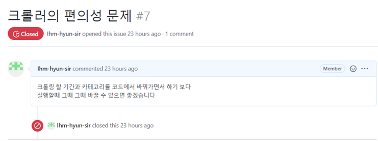
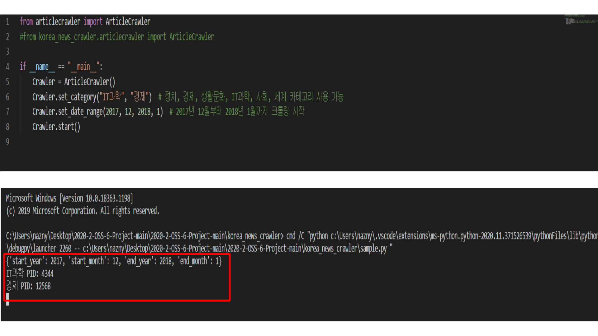
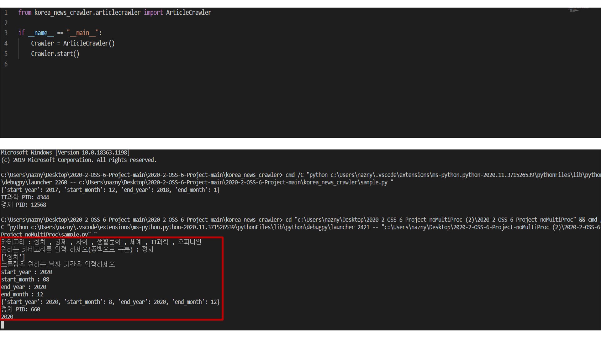

## 1. 시작 시 사용자에게 크롤링 기간과 카테고리를 입력받도록 개선

기존 크롤링 프로그램은 보시다시피 실행하기 전 코드에서 카테고리와 날짜를 미리 설정해야 한다. 
매번 바꾸는 과정이 번거롭다 생각하여, 프로그램을 실행시킬 때 마다 카테고리와 날짜를 입력받아 출력할 수 있도록 바꾸기로 하였다.


articlecrawler.py에 코드 첨가 
```python
    def get_catergory(self):
        print("카테고리 : 정치 , 경제 , 사회 , 생활문화 , 세계 , IT과학 , 오피니언, 연합뉴스속보")
        print("원하는 카테고리를 입력 하세요(공백으로 구분) : ",end ='')
        choosen_categories = input()
        choosen_list = choosen_categories.split(' ')
        print(choosen_list)
        return choosen_list
    
    def get_date(self):
        print("크롤링을 원하는 날짜 기간을 입력하세요 ")
        for keys in self.date.keys() :
            print(keys + " : ",end= '')
            get_date = int(input())
            self.date[keys] = get_date
```
get_catergory함수와 get_date함수를 통해 시작과 함께 사용자에게 크롤링 할 기간과 그 카테고리를 입력받도록 함.


## 2. 적용 전 후 비교
**적용 전**

**적용 후**

- - -
**Merge 방법**: 위 개선 사항은 comfortable 이라는 branch로 올라갔으며, noMultiProc과 merge되었다.
noMultiProc과 comfortable 두 브랜치가 main브랜치에서 articlecrawler.py라는 같은 파일을 수정했기에, 충돌을 방지하기위해 수동으로 코드 merge하였다.

- - -

