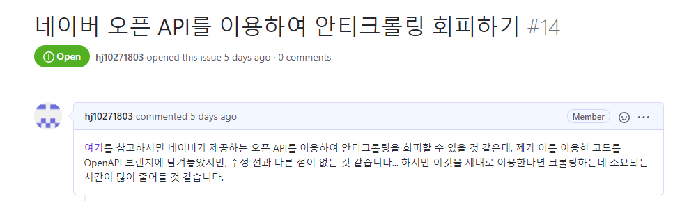
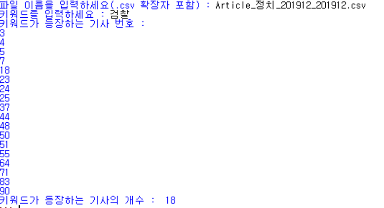

## 1. 네이버 오픈 API를 통해 안티크롤링 회피 시도

기존 코드에서는 안티크롤링을 회피하느라 많은 시간을 소모하여 크롤링이 완료될 때까지 시간이 너무 오래 걸렸다.

따라서, 우리는 이를 해결하고자 네이버 Developers에서 제공하는 네이버 오픈 API 서비스를 이용하여 안티 크롤링을 회피하고자 하였다.


먼저, 네이버 Developers에서 애플리케이션 등록을 완료해서 Client id와 Client secret을 발급받았고, 발급받은 정보들을 코드에 추가하였다.


articlecrawler.py와 articleparser.py에 정보 추가
```python
clientId = "a1iQBNA9ABqLk88S0m0X"
clientSecret = "NnuTDAbz6P"
header = {
    "X-Naver-Client-Id":clientId,
    "X-Naver-Client-Secret":clientSecret
}
```

그리고, 서버에 정보를 요청할 때 마다 이러한 정보를 전달하는 식으로 안티크롤링을 회피하고자 하였다.

그리고 이렇게 수정한 코드를 OpenAPI 브랜치를 새로 만들어 그곳에 push와 commit을 하였다.


하지만 이 코드는 제대로 작동하지 않았고, 제대로 작동하지 않는 문제에 대한 해결책을 찾기 위해 새로운 issue를 제안하였다.



## 2. 내용에서 키워드 검색 기능 추가

우리는 키워드를 제목에서 검색하는 기능을 구현한 이후에, 내용에서도 키워드를 검색할 수 있도록 하고자 하였다. 

하지만 내용에서 키워드를 검색하는 과정을 크롤링 도중에 진행하면 너무 많은 시간이 소요되고 복잡해지기 때문에, 지금까지 크롤링을 한 결과가 담겨 있는 파일 이름을 입력하면, 그 파일의 기사 내용에서 키워드를 검색하는 파일 입출력 방식으로 문제를 해결하였다.


sample_keyword.py 코드 추가
```python
#파일 입출력을 통해 기사 내용에서 키워드 찾기
import csv

file = input("파일 이름을 입력하세요(.csv 확장자 포함) : ")
keyword = input("키워드를 입력하세요 : ")
cnt = 0
line = 1
#csv 파일 열기
with open(file, 'r') as f:
    reader = csv.reader(f)
    print("키워드가 등장하는 기사 번호 : ")
    for txt in reader:
        #csv파일의 각 줄에서 원하는 키워드 찾기
        if txt[4].find(keyword) != -1:
            print(line)
            cnt += 1
        line += 1
print("키워드가 등장하는 기사의 개수 : ", cnt)
```

이 코드는 파일 이름을 입력하고, 원하는 키워드를 입력하면 그 키워드가 나오는 csv 파일에서의 기사 번호를 모두 출력하고, 키워드가 나오는 기사의 개수가 총 몇개인지 마지막으로 출력해준다.

코드는 밑의 실행 결과 사진을 보면 알 수 있듯이, 정상적으로 작동하였다.


