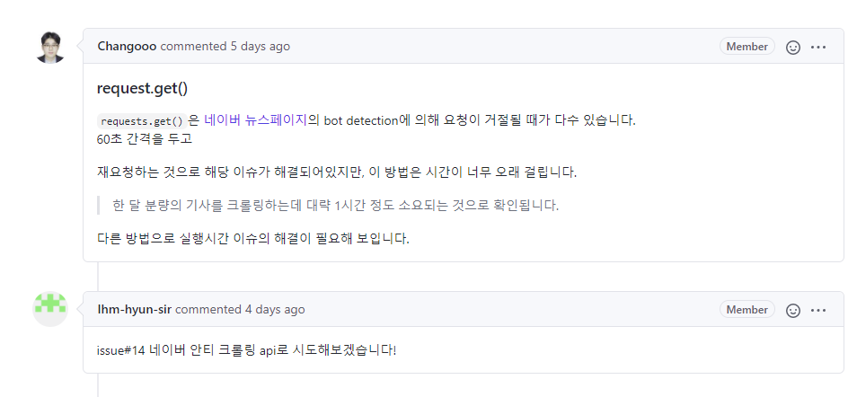

## 1. 네이버 오픈 API를 통해 안티크롤링 회피 시도

기존 코드에서는 안티크롤링을 회피하느라 많은 시간을 소모하여 크롤링이 완료될 때까지 시간이 너무 오래 걸렸다.
따라서, 우리는 이를 해결하고자 네이버 Developers에서 제공하는 네이버 오픈 API 서비스를 이용하여 안티 크롤링을 회피하고자 하였다.


먼저, 네이버 Developers에서 애플리케이션 등록을 완료해서 Client id와 Client secret을 발급받았고, 발급받은 정보들을 코드에 추가하였다.

articlecrawler.py와 articleparser.py에 정보 추가
```python
clientId = "a1iQBNA9ABqLk88S0m0X"
clientSecret = "NnuTDAbz6P"
header = {
    "X-Naver-Client-Id":clientId,
    "X-Naver-Client-Secret":clientSecret
}
```

그리고, 서버에 정보를 요청할 때 마다 이러한 정보를 전달하는 식으로 안티크롤링을 회피하고자 하였다.
그리고 이렇게 수정한 코드를 OpenAPI 브랜치를 새로 만들어 그곳에 push와 commit을 하였다.

하지만 이 코드는 제대로 작동하지 않았고, 제대로 작동하지 않는 문제에 대한 해결책을 찾기 위해 새로운 issue를 제안하였다.
