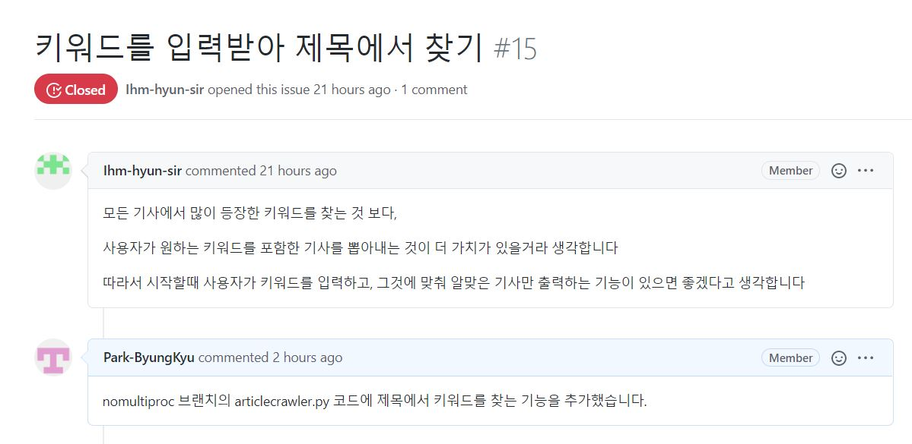
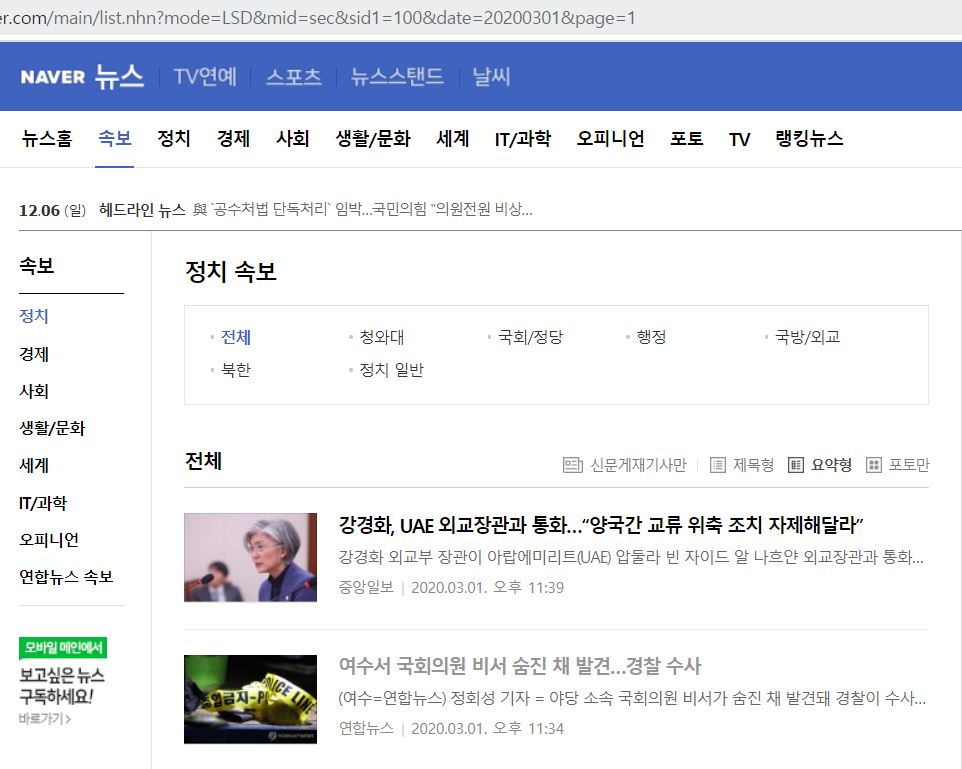
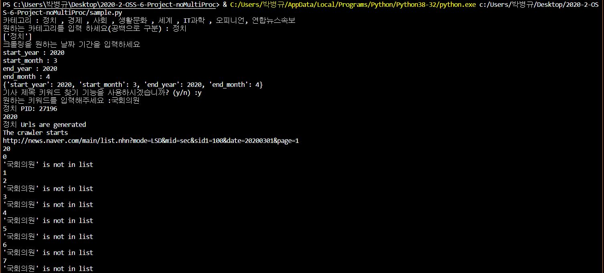
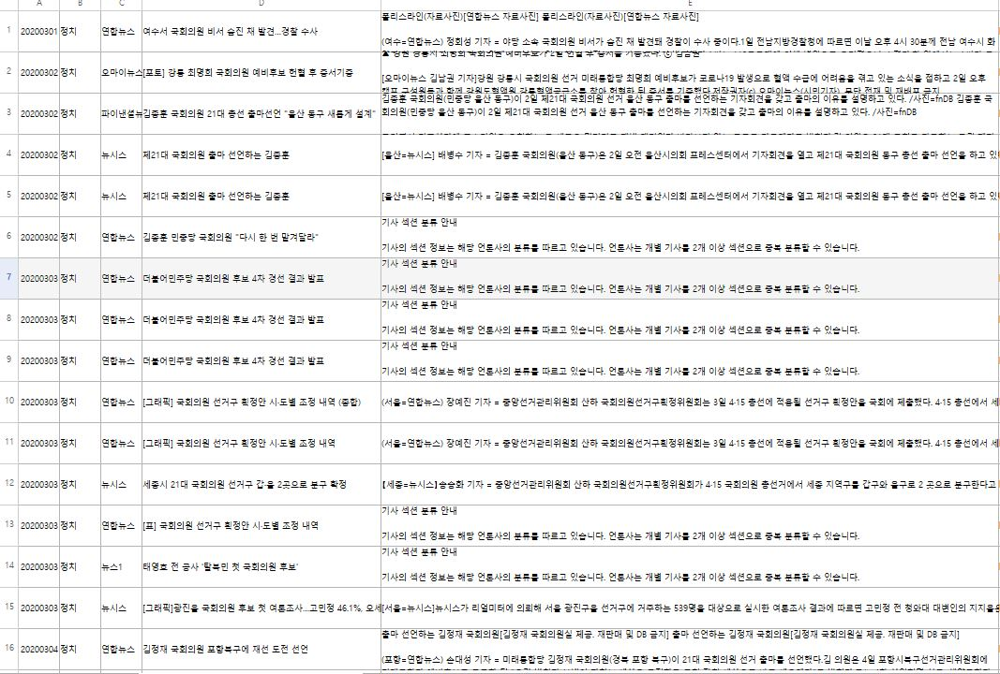
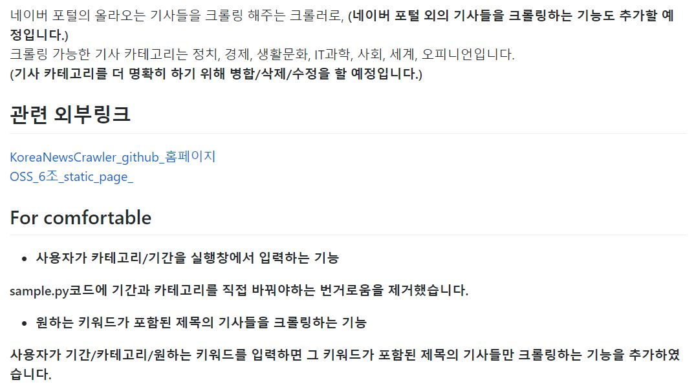

## 1. 키워드를 입력받아 제목에서 찾는 코드

이 코드의 원래 기능은 크롤링을 할 때 기간, 카테고리를 정하면 기사를 모두 크롤링 하는 것,
15번 이슈를 통해 사용자가 **키워드를 입력하면 제목에 해당 키워드가 포함된 기사들**만 .csv 파일에 저장하도록 하는 기능 추가


articlecrawler.py에 코드 첨가   
```python
def get_keyword(self):
    keyword = 'initvalue'
    ynkeyword = input("기사 제목 키워드 찾기 기능을 사용하시겠습니까? (y/n) :")
    if ynkeyword == "n" or ynkeyword == "N":
        return keyword
    elif ynkeyword == "y" or ynkeyword == "Y":
        keyword = input("원하는 키워드를 입력해주세요 :")
        return keyword
    else:
        print("invalid input")
        return keyword
```
get_keyword() 함수를 만들어 사용자가 제목 키워드 검색 기능을 사용할 것인지 묻고, 사용한다면 키워드를 입력 받아 return 할 수 있도록 코드 작성

## 2. 키워드가 포함된 기사만 엑셀 파일에 쓰는 코드

.csv 파일에 데이터를 넣을 때 keyword가 포함되었는지 검사하는 코드 작성  
제목 키워드 검색 기능을 사용하지 않는다면 모두 .csv 파일에 쓰고, 사용한다면 제목에 키워드가 포함된 기사만 .csv 파일에 쓰도록 작성

```python
    if self.keyword == 'initvalue':
        wcsv = writer.get_writer_csv()
        wcsv.writerow([news_date, category_name, text_company, text_headline, text_sentence, content_url])
    else:
        headline_to_words = text_headline.split()
        if headline_to_words.index(self.keyword) >= 0:
            wcsv = writer.get_writer_csv()
            wcsv.writerow([news_date, category_name, text_company, text_headline, text_sentence, content_url])
```
**Merge 방법**: addkeyword 브랜치에서 이전 과정들을 업데이트하고, 위의 기능을 추가 -> 다시 noMultiproc 브랜치에 merge

## 3. 코드 작동 테스트


이 사진과 같이 2020년 3월 1일 정치 카테고리의 2번째 기사 제목에 ‘국회의원’이라는 단어가 포함   


실행할 때 오른쪽 사진처럼 카테고리를 정치, 시작기간을 2020년 3월, 키워드를 정치로 입력하고 크롤링을 진행하면 1페이지의 2번째 기사가 크롤링이 되었음을 확인 가능  


크롤링이 모두 완료된 후 엑셀 파일을 실행하면 다음과 같이 제목에 ‘국회의원’이 들어간 기사들만 쓰여짐

## 4. 프로젝트 read.me 수정

readme 업데이트 과정에서 원본 크롤링 깃허브 홈페이지, 6조의 정적페이지의 외부링크를 달았고, 업데이트한 기능들 정리

