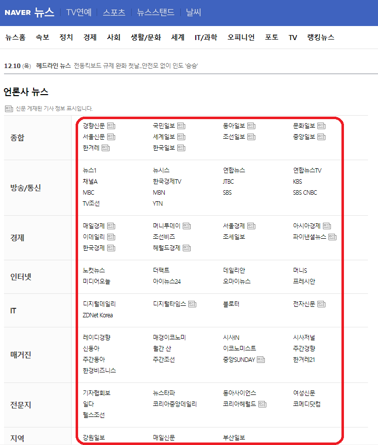
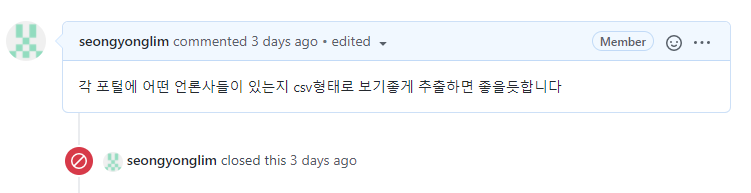
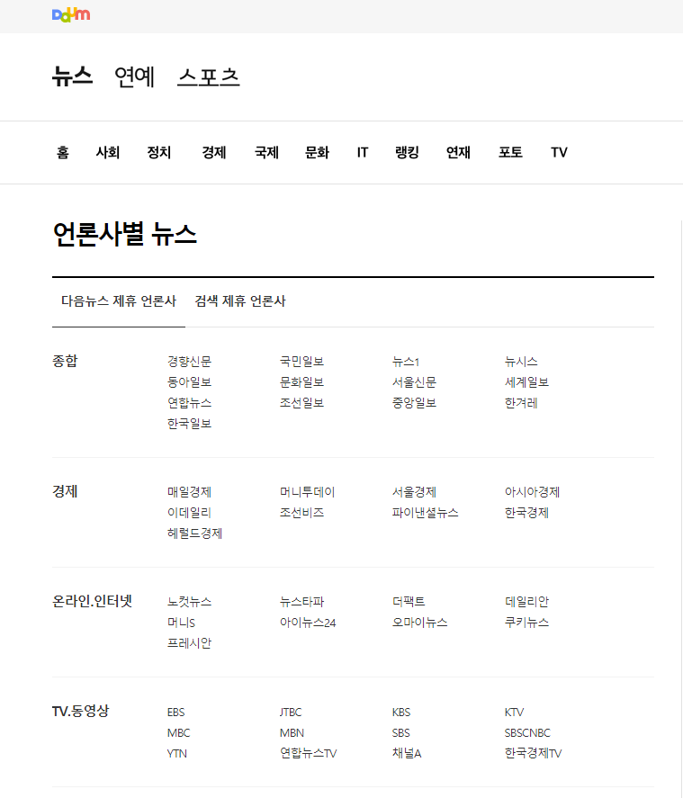
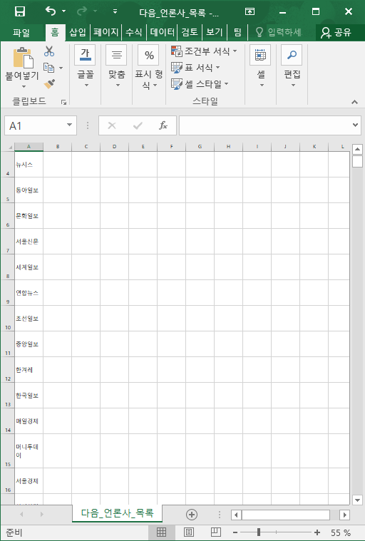

## 1. 언론사 목록 출력

각 포털마다 언론사별 뉴스 카테고리가 있는데 이를 활용하여 언론사 목록을 추출해봤습니다.





## 2. 코드 작성

presscrawler.py라는 py코드를 새로 만들어 작성한 내용입니다.

```python
class Press(object):
    def __init__(self):
        pass

    def crawling(self, press):
        URL = ""
        ul= ""
        pressList=[]
        user_operating_system = str(platform.system())
            
        if press == "다음":
            URL = "https://media.daum.net/cp/"
            ul = "list_cp"

        elif press == "네이버":
            URL = "https://news.naver.com/main/officeList.nhn"
            ul = "group_list"
        
        url = urlopen(URL)
        document = BeautifulSoup(url, 'html.parser')
        for link in document.find_all("ul", {"class": ul}):
            for li in link.find_all("li"):
                pressList.append(li.find("a").get_text())

        #csv 작성
        if user_operating_system == "Windows":
            f = open(press+'_언론사_목록.csv','w', encoding='euc-kr',newline='')
        else: #다른 OS는 utf-8 이용.
            f = open(press+'_언론사_목록.csv','w', encoding='utf-8',newline='')
        wr = csv.writer(f)
        for i in pressList:
            wr.writerow([i])
        f.close()
```

## 3. 크롤러 실행 결과





1000여개의 다음 포털 언론사들이 csv에 잘 크롤링된 모습이다.

