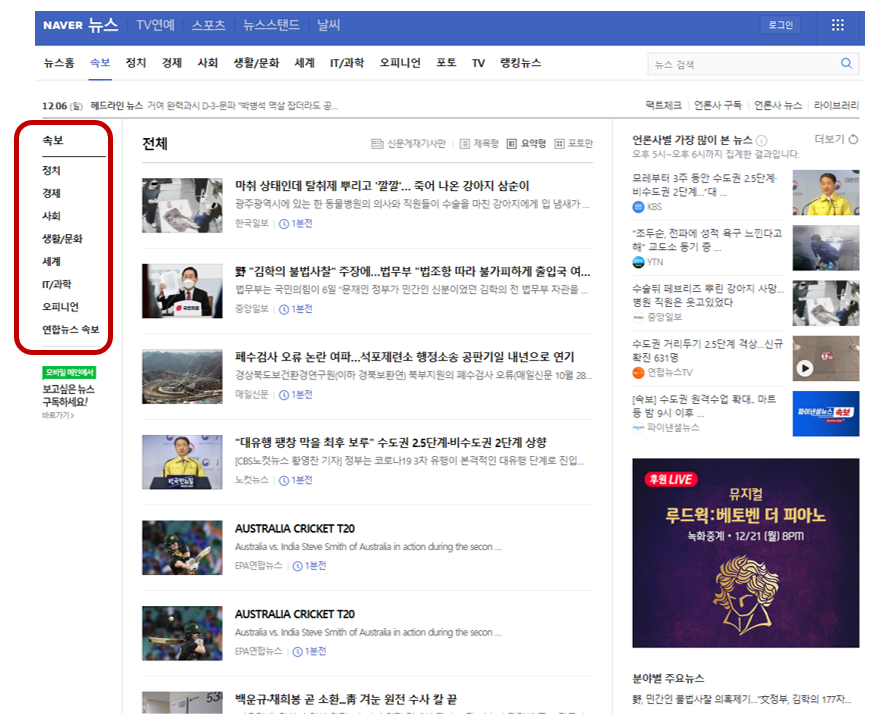
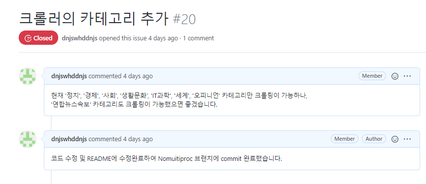
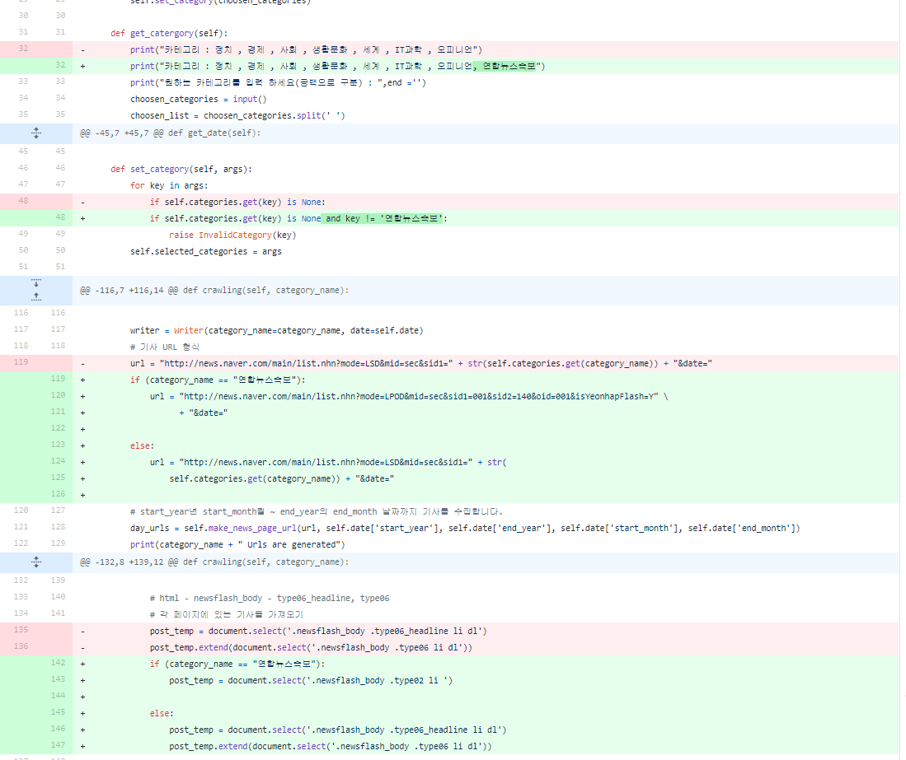
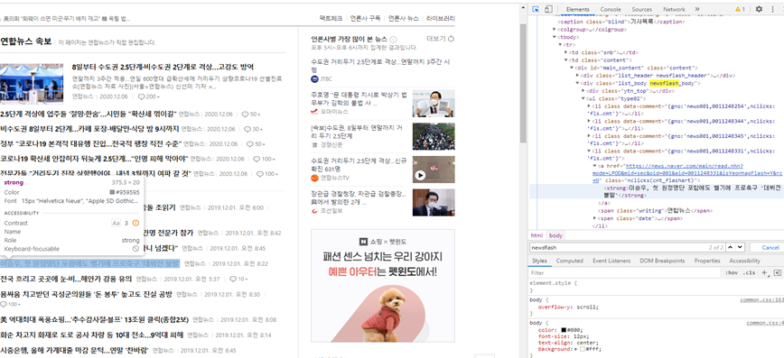
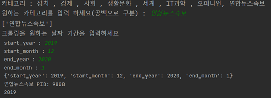
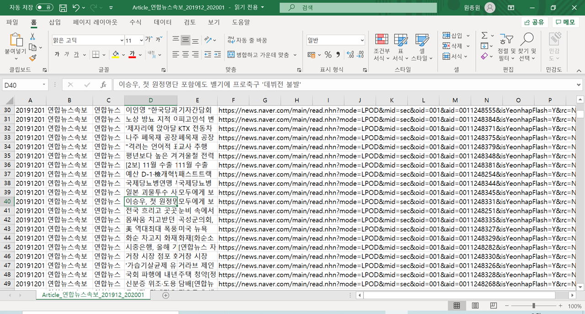
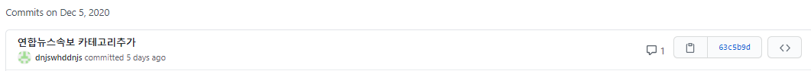
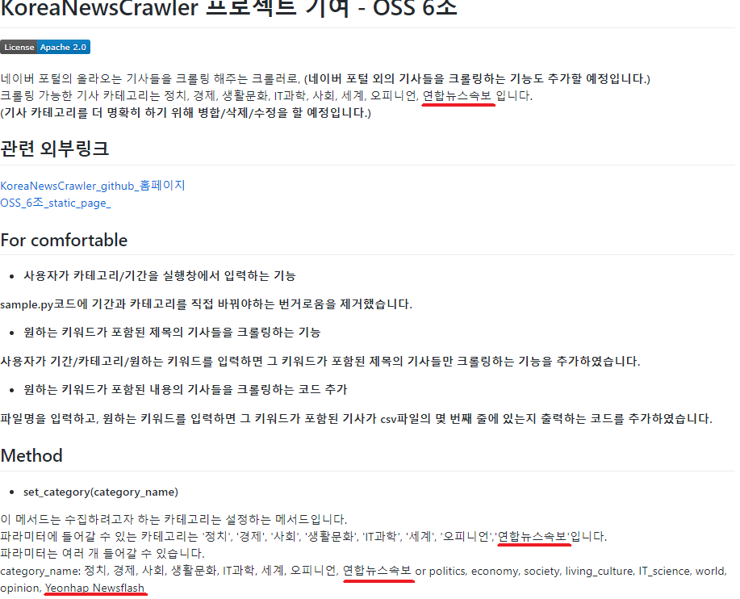
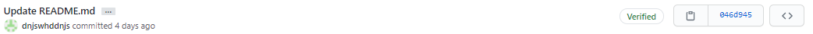

## 1. 크롤링 카테고리 추가 
기존 크롤링은 '정치,'경제','시회','생활문화','IT과학','세계','오피니언'카테고리만 크롤링이 가능

따라서 '연합뉴스속보'카테고리도 크롤링이 가능하도록 수정

articlecrawler.py에 코드 수정 

이때 '연합뉴스속보'카테고리 html 형식에 맞추어 기존 카테고리와 동일한 방식으로 크롤링하도록 코드 수정

## 2. 크롤링 실행

정상적으로 실행되는 것을 확인할 수 있음

크롤링 결과

## 3. commit 작성 및 readme 수정

코드 수정중 nomultiproc 브랜치에서 크롤링 카테고리와 진행상황을 볼수 있도록 코드가 수정된것을 확인하고 main 브랜치가 아닌 nomultiproc브랜치에 바로 commit하였

